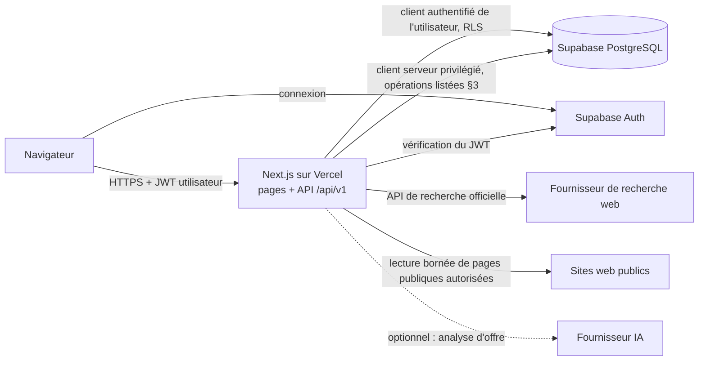

# ProspectOS — Architecture, sécurité et gouvernance

Document destiné aux DSI, CTO et RSSI. Il décrit l'état du code de production (branche `main`). Chaque
mécanisme cité est implémenté et couvert par des tests, sauf mention **Bêta** (disponible sous condition
d'activation) ou **Roadmap** (non disponible). Aucune valeur de secret, identifiant de projet ou
d'infrastructure n'y figure.

## 1. Vue générale



- Le navigateur ne parle jamais directement aux fournisseurs externes ni aux sites analysés.
- Toutes les opérations métier passent par l'API serveur `/api/v1`, qui exige un jeton Supabase valide.

## 2. Architecture logique

| Composant | Rôle |
|---|---|
| Frontend (Next.js, React) | Interface FR/EN, démo publique locale (données dans le navigateur uniquement), espace connecté |
| API serveur (`/api/v1`) | Authentification, contrôle d'accès bêta, orchestration, mapping d'erreurs sans fuite d'information |
| Base (PostgreSQL / Supabase) | Données tenant, RLS, fonctions RPC contrôlées, quotas, journaux |
| Auth (Supabase Auth) | Comptes e-mail / mot de passe, jetons JWT |
| Discovery | Plan de requêtes, appel au fournisseur de recherche, classement des sources, résolution d'entité, déduplication |
| Novelty | Mémoire du projet, statut `NEW` / `SEEN` / `ADDED` / `IGNORED` / `CURRENT_RUN_DUPLICATE`, Search-Until-New borné |
| Analyse de sites | Téléchargement sécurisé de pages publiques, extraction déterministe (sans IA), propositions rattachées aux critères |
| Evidence | Observations, revue humaine, preuves `VERIFIED` / `CONTRADICTED`, score |
| Quotas | Réservation persistante avant tout appel externe |
| Audit | Historique des recherches, journal des analyses de sites, événements en ajout seul, registre des coûts |

## 3. Multi-tenancy

- **Organisations et memberships** : toute donnée métier (projets, ICP, prospects, recherches, preuves,
  messages) appartient à une organisation. Un utilisateur y accède par une ligne `memberships` (rôle
  `owner` ou `member`).
- **Isolation** : Row Level Security activée sur les tables métier ; chaque requête applicative s'exécute
  avec le JWT de l'utilisateur, donc sous RLS. Des clés étrangères composites (organisation + objet)
  empêchent de rattacher un objet d'une organisation à une autre.
- **Mutations sensibles** : réalisées par des fonctions RPC `SECURITY DEFINER` qui vérifient elles-mêmes
  l'appartenance (ou le rôle `owner`), avec `search_path` vide et droits d'exécution explicites ; elles ne
  sont pas exposées au rôle anonyme.
- **Client serveur privilégié** (clé de service, jamais exposée au navigateur) : limité à des opérations
  qui ne doivent être accessibles à aucun rôle client — écriture des résultats Discovery et du registre de
  coûts, déchiffrement d'une clé API client (BYOK), anonymisation d'un compte supprimé. Chacune de ces
  opérations n'intervient qu'après une étape réalisée sous l'identité de l'utilisateur (lecture sous RLS ou
  RPC contrôlée).
- **Création d'organisation** : atomique, via RPC, au premier projet.
- **Tests** : l'isolation (deux identités, rôle anonyme, lectures croisées refusées) est testée sur un vrai
  moteur PostgreSQL (PGlite) avec la chaîne complète des migrations.

## 4. Authentication / Authorization

- **Supabase Auth** : comptes e-mail / mot de passe ; acceptation des CGU et de la politique de
  confidentialité enregistrée à la création du compte.
- **API** : chaque appel exige `Authorization: Bearer <JWT>` ; le jeton est vérifié auprès de Supabase
  Auth avant toute action (sinon HTTP 401).
- **Base** : `auth.uid()` + `memberships` déterminent ce que RLS laisse lire ou écrire.
- **Droit d'usage** : les actions coûteuses (recherche, analyse de site, analyse d'offre, préparation de
  message) exigent un accès actif (bêta ou interne), vérifié côté serveur (sinon HTTP 402). La lecture, l'export
  et la suppression de compte restent toujours possibles.
- **Administration** : pas de console d'administration client. Les opérations d'exploitation (accès bêta,
  réglage des quotas) sont réalisées par un opérateur en SQL. Une vue d'analyse agrégée de la bêta est
  réservée au plan interne.

## 5. Données manipulées

### Données utilisateur

- compte (e-mail, acceptation des conditions) ;
- organisation et memberships ;
- projets, offre, ICP (critères et poids) ;
- prospects et leur statut dans le pipeline ;
- décisions : ajout ou rejet d'un résultat, confirmation ou contradiction d'une preuve ;
- brouillons de messages ;
- historique des recherches et des événements.

### Données publiques collectées

- nom d'entreprise, domaine, page source, titre et extrait de la page de résultat ;
- pages publiques du site d'un prospect (URL, titre, extrait retenu, date, empreinte) ;
- coordonnées professionnelles publiées sur ces pages (téléphone, e-mail), marquées « observées », jamais
  « vérifiées » sans action humaine ;
- observations et signaux d'activité rattachés aux critères de l'ICP.

Aucune donnée de réseau social n'est collectée par le collecteur ; aucune métrique sociale n'est inventée.

### Secrets

- clés de service et d'API (base, fournisseur de recherche, fournisseur IA) : variables d'environnement
  côté serveur uniquement, jamais préfixées pour le navigateur, jamais journalisées ;
- **BYOK (Bêta)** : une organisation peut enregistrer sa propre clé API ; elle est chiffrée côté serveur
  (AES-256-GCM, clé maîtresse serveur) avant d'atteindre la base, n'est jamais renvoyée en clair (seuls les
  4 derniers caractères sont affichés) et n'est utilisée aujourd'hui que pour l'analyse d'offre (Anthropic).
  Une clé illisible fait échouer l'appel ; le système ne bascule pas silencieusement sur la clé de la
  plateforme.

## 6. Evidence lifecycle

```
source publique
  → observation (URL, extrait exact, date, empreinte)
  → classification (rattachement proposé à un critère de l'ICP)
  → INFERRED / OBSERVED / UNKNOWN          (0 point)
  → revue humaine : confirmer / contredire / laisser non vérifié
  → VERIFIED (compte dans le score) ou CONTRADICTED (0 point)
```

| État technique | Sens |
|---|---|
| `OBSERVED` | fait lu tel quel sur la page (ex. un numéro de téléphone), non vérifié |
| `INFERRED` / `INFERRED_UNCONFIRMED` | rattachement proposé par règles à un critère, à confirmer |
| `UNKNOWN` | information absente des pages analysées ; jamais interprétée comme un « non » |
| `NOT_VERIFIED` | preuve saisie ou proposée, pas encore revue |
| `VERIFIED` | confirmée par un utilisateur identifié |
| `CONTRADICTED` | infirmée par un utilisateur ; points retirés |

**No auto-VERIFIED.** Garanties :

- le score ne compte que les preuves `VERIFIED`, attribuées à un vérificateur, avec une source et un
  extrait, datées de moins de 90 jours ;
- une contrainte de base de données refuse toute preuve `VERIFIED` ou `CONTRADICTED` sans vérificateur,
  source et extrait ;
- l'extraction est déterministe (règles), sans modèle de langage ;
- deux preuves vérifiées contradictoires sur un critère le placent en conflit (0 point) jusqu'à revue.

## 7. Discovery security

- **Recherche** : uniquement via l'API officielle du fournisseur de recherche, côté serveur. Aucun
  navigateur automatisé, aucune connexion à un service tiers, aucun contournement de CAPTCHA.
- **Classement des sources** : annuaires, médias, pages de recherche et pages non pertinentes sont
  distingués des entreprises ; seuls les candidats exploitables comptent comme « nouveaux ».
- **Autorisation d'analyse décidée par le serveur** : un site n'est téléchargé que s'il a été découvert
  par ProspectOS comme site propre de l'entreprise puis accepté par l'utilisateur (activation opérateur,
  **Bêta**), ou s'il figure dans une liste d'hôtes autorisés par l'opérateur. Le navigateur ne fournit
  jamais la destination.
- **Validation des URL et protection SSRF** : HTTP/HTTPS et ports standards uniquement, pas
  d'identifiants dans l'URL, refus des adresses non publiques (locales, privées, réservées, métadonnées
  cloud), contrôle de toutes les réponses DNS et connexion à l'adresse validée ; chaque redirection est
  recontrôlée et ne peut ni quitter le domaine autorisé ni passer de HTTPS à HTTP.
- **Bornes** : délai d'expiration, taille de réponse et nombre de redirections limités, nombre de pages
  par site limité, pas d'exécution de JavaScript.
- **robots.txt** : respecté ; il n'est pas considéré à lui seul comme une autorisation contractuelle.
- **Fail-closed** : sans autorisation, analyse refusée ; en cas d'erreur, rien n'est déduit et aucun
  critère n'est modifié.
- **LinkedIn** : aucune automatisation (ni connexion, ni invitation, ni message) ; les liens LinkedIn ne
  sont pas collectés.

## 8. Quotas / abuse prevention

- Quotas persistants en base, réservés avant l'appel externe, sous verrou transactionnel (pas de
  dépassement par requêtes concurrentes) ; un échec consomme sa réservation.
- Recherches et analyses d'offre : par organisation. Analyses de sites : par organisation **et** par
  utilisateur.
- Nombre de résultats par recherche plafonné.
- **Search-Until-New** : une recherche approfondie consomme une seule unité de quota, envoie au plus le
  même nombre de requêtes qu'une recherche normale, dans un budget de temps fixe ; chaque requête est
  enregistrée au registre des coûts. Aucune boucle non bornée.
- Les valeurs sont des réglages techniques configurables par l'opérateur, sans engagement contractuel.

## 9. Auditability

- **Historique des recherches** : paramètres, fournisseur, statut, métriques (résultats, exploitables,
  écartés, nouveauté, passes, raison d'arrêt), coût ; une recherche passée se relit sans nouvel appel.
- **Instantané de nouveauté** : ce que le projet savait au moment de chaque recherche est conservé et
  jamais réécrit.
- **Journal des analyses de sites** : chaque tentative sur un site réel (hôte, mode d'autorisation,
  résultat, pages) — métadonnées seulement, sans contenu.
- **Événements métier** : table en ajout seul (modification et suppression interdites par déclencheur).
- **Preuves** : source, extrait, date, auteur de la confirmation.
- **Score** : décomposition par critère, avec la preuve retenue ou la mention « à confirmer ».
- **Registre des coûts** : appels facturables par fournisseur, avec la version du tarif appliqué.
- **Export de compte** : journalisé.

## 10. Dépendances tierces

| Dépendance | Rôle | Données concernées | Nature de la dépendance |
|---|---|---|---|
| Supabase | Authentification, base PostgreSQL | toutes les données utilisateur et collectées | critique : sans elle, pas d'espace connecté (la démo publique reste locale) |
| Vercel | Hébergement de l'application et de l'API | données en transit ; journaux d'exécution | critique pour l'accès au service |
| Fournisseur de recherche web (API officielle) | Discovery | requête, zone, catégories saisies par l'utilisateur | nécessaire pour une recherche réelle ; indisponible → la recherche échoue proprement |
| Web public | Sites analysés | pages publiques des prospects | par site ; un site inaccessible n'affecte que ce prospect |
| Fournisseur IA (optionnel) | Analyse d'offre | texte de l'offre soumis par l'utilisateur | optionnelle ; désactivée sans configuration |

Aucun engagement de disponibilité n'est pris au-delà de ceux de ces fournisseurs.

## 11. Rétention

Mécanismes présents :

- **Export de compte** : archive des données accessibles à l'utilisateur (compte, organisations, projets,
  ICP, prospects, preuves, canaux, messages, historique), générée sous RLS, sans secret.
- **Suppression de compte** : retrait des memberships, puis anonymisation du compte d'authentification
  (e-mail remplacé, compte désactivé). Refusée si l'utilisateur est le dernier propriétaire d'une
  organisation qui contient encore des données.
- **Démo publique** : données uniquement dans le navigateur de l'utilisateur.

Non automatisé à ce jour :

- aucune purge automatique des recherches, résultats, observations ou journaux ;
- pas de suppression d'organisation en libre-service ;
- pas de liste d'opposition durable gérée par le produit.

Une politique de rétention doit être définie avant un usage commercial à grande échelle.

## 12. Failure modes

| Situation | Comportement |
|---|---|
| Site inaccessible, erreur réseau | analyse marquée impossible ; aucun critère modifié ; rien n'est déduit |
| robots.txt refusant l'accès | page non analysée |
| Délai dépassé | requête interrompue, réponse détruite |
| Source ambiguë (nom ou domaine non résolu) | résultat marqué « non résolu », jamais compté comme nouveau, ajout soumis à décision explicite |
| Doublon probable | aucune fusion automatique ; décision explicite de l'utilisateur ; un acteur déjà ajouté ne peut être ajouté une seconde fois |
| Absence de preuve | critère « à confirmer », 0 point |
| Fournisseur de recherche indisponible | première requête en échec → recherche en échec ; échec d'une passe ultérieure (Search-Until-New) → résultats déjà trouvés conservés, raison d'arrêt indiquée |
| Mémoire du projet illisible | la recherche aboutit sans étiquette de nouveauté (jamais de faux « nouveau ») |
| Quota atteint | action refusée avant tout appel externe |
| Accès bêta expiré | actions coûteuses refusées (HTTP 402) ; lecture, export et suppression restent possibles |

## 13. Déploiement

- Application et API : Vercel (environnements Production et Preview).
- Base et authentification : Supabase (PostgreSQL managé).
- Schéma versionné par migrations SQL transactionnelles ; une migration appliquée n'est jamais modifiée.
- Secrets : variables d'environnement serveur de la plateforme d'hébergement.
- Validation avant mise en production : tests unitaires, tests PostgreSQL (RLS, RPC, quotas) sur la chaîne
  complète des migrations, typecheck, build.

Il n'existe pas d'autre topologie de déploiement.

## 14. Limites sécurité / conformité

- Pas de certification SOC 2 ni ISO 27001.
- Pas de SSO entreprise (SAML / OIDC) ni de provisioning d'utilisateurs.
- Pas d'invitations d'équipe ni de gestion de rôles avancée dans l'interface (rôles `owner` / `member` en
  base).
- Pas de déploiement on-premise ni de choix d'hébergement dédié.
- Pas de SLA contractuel.
- Pas d'en-têtes de sécurité HTTP personnalisés (CSP, etc.) configurés dans le dépôt de l'application.
- Pas de purge automatique ni de politique de rétention configurable (voir §11).
- Aucun test de pénétration externe n'est documenté à ce jour.

## 15. Roadmap enterprise

À titre indicatif, non disponible aujourd'hui :

- SSO (SAML / OIDC) et provisioning ;
- invitations d'équipe, rôles et permissions avancés ;
- audit avancé (export des journaux, rétention configurable) ;
- politiques d'organisation (sources autorisées, rétention, opposition) ;
- intégrations CRM ;
- options de déploiement et de localisation des données.
